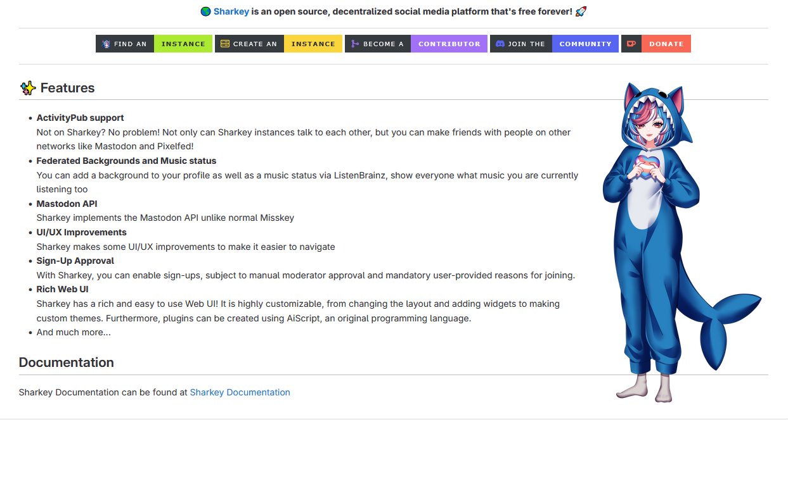

<!--
N.B.: This README was automatically generated by <https://github.com/YunoHost/apps/tree/master/tools/readme_generator>
It shall NOT be edited by hand.
-->

# Sharkey for YunoHost

[](https://ci-apps.yunohost.org/ci/apps/sharkey/)  

[](https://install-app.yunohost.org/?app=sharkey)

*[Read this README in other languages.](./ALL_README.md)*

> *This package allows you to install Sharkey quickly and simply on a YunoHost server.*  
> *If you don't have YunoHost, please consult [the guide](https://yunohost.org/install) to learn how to install it.*

## Overview

## 🌎 A Sharkish microblogging platform 🦈🚀 

_Sharkey_ is an Misskey fork following upstream changes when possible, with added features!

### ⚠️ PLEASE READ CAREFULLY ⚠️

**Sharkey** requires **redis** version **7**, but YunoHost does not currently support this version.
Some functions will not be available if you install this package.

I advise you to wait for the release of _Bookworm_ Debian 12.


**Shipped version:** 2024.5.1~ynh1

## Screenshots



## Documentation and resources

- Official app website: <https://git.joinsharkey.org/Sharkey>
- Upstream app code repository: <https://activitypub.software/TransFem-org/Sharkey>
- YunoHost Store: <https://apps.yunohost.org/app/sharkey>
- Report a bug: <https://github.com/YunoHost-Apps/sharkey_ynh/issues>

## Developer info

Please send your pull request to the [`testing` branch](https://github.com/YunoHost-Apps/sharkey_ynh/tree/testing).

To try the `testing` branch, please proceed like that:

```bash
sudo yunohost app install https://github.com/YunoHost-Apps/sharkey_ynh/tree/testing --debug
or
sudo yunohost app upgrade sharkey -u https://github.com/YunoHost-Apps/sharkey_ynh/tree/testing --debug
```

**More info regarding app packaging:** <https://yunohost.org/packaging_apps>
